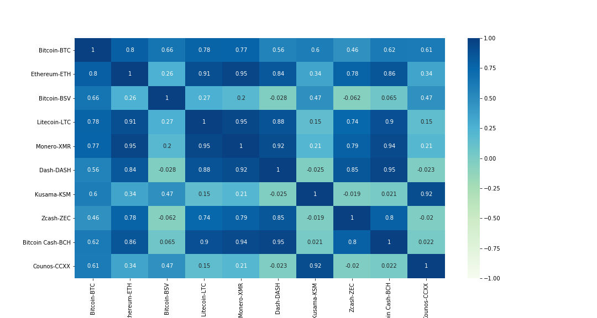

# Team Bitantics: Crash Course in Cryptocurrencies

### Team Members
- Blake
- Kelly
- Tony
- April 

## Description
Compare the data & trading movement of the cryptocurrencies asset class. Determine intra/cross similarities and differences between crypto and other asset classes (global indices) and determine nature of relationships.

## Research Questions
- How many different cryptocurrencies are out in the market?
- What is the relationship between cryptocurrencies?
- What similarities and differences can we draw between cryptocurrencies and other asset classes?
- What fiat currencies are accepted for buying/selling cryptocurrencies? How often is one fiat currency used compared to another?
- Is crypto a viable asset class? Who are the winners and laggards?

## Datasets used
- Cryptocurrency pricing & volume datasets from Coinbase and CoinMarketCap
- Global World, Regional & Country Indices from Investing.com

## APIs & new Python package used
- Coinbase REST API - cryptocurrency historical data (volume)
- Dealing with rate limits and amount of data returned
- CoinMarketCap - cryptocurrency historical prices
- Investing.com - global indices data using investpy Python package

## Features Delivered
- Data Ingestion of trading information about cryptocurrencies and global indices
- Data Cleaning & Shaping
- Exploratory Data Analysis (EDA)
- Reports/Dashboards
- Presentation

## Key Assets
- Combined Data Prep Notebook ([data_processing.ipynb](notebooks/data_processing.ipynb))
- Combined Analysis & Dashboard Notebook ([final_analysis.ipynb](notebooks/final_analysis.ipynb))
- Various notebooks used per analysis domain
- Saved data sources & DataFrames via CSV [files](data)
- Saved visualization PNG [images](images)
- PowerPoint presentation

## Findings

### How many different cryptocurrencies are out in the market?

- There are >4000 unique cryptocurrencies out in the market per CoinMarketCap. 
- Coinbase, one of the most well known exchanges, supports trading over 40 cryptocurrencies.

### What is the relationship between cryptocurrencies?

- From the top 10 cryptos by market cap in 2020, Bitcoin is king with an average closing price of $11,180 vs Kusama closing with an average of $17.36. 
- Bitcoin and Ethereum are closely correlated (0.8) and Bitcoin SV and Zcash are least correlated (-0.062). 

### What similarities and differences can we draw between cryptocurrencies and other asset classes?
Bitcoin is the most volatile among the 10 cryptos and Counos is the least risky by the end of 2020. 

30 of the Top Global & Regional Indices were surveyed, including S&P 500, FTSE 100 and Shanghai Composite, from 2000 to present day in comparison to the major cryptocurrencies listed above. From first glance by comparing correlations across tickers, crypto as an asset looks to be a class of its own without much similarities to the trends of the global and regional markets.

We can spot the major world events in the daily returns of global indices (dot.com bubble/ 9/11, 2008 crisis, 2015 Greek Financial Crisis, 2020 Pandemic)

But when crypto is added alongside the global indices as an asset class, these historical trends quickly become a non-factor.

### What fiat currencies are accepted for buying/selling cryptocurrencies?

The US dollar, Pound Sterling and Euro are widely accepted across the exchanges. Also accepted are the Japanese yen, the Russian ruble, the Australian dollar, the Singapore dollar, and the Canadian dollar. Coinbase accepts: USD, GBP, EUR, AUD, SGD, and CAD.

### How often is one fiat currency used compared to another?

The USD is the most popular fiat currency used to buy cryptocurrencies. Coinbase's historical data shows the US dollar (USD) is more popular by volume (total # of coins/token) than the Pound Sterling (GBP) and Euro (EUR).

Additionally, the USD is also used to buy more cryptocurrencies than the other fiat currencies.

### Is crypto a viable asset class? Who are the winners and laggards?
The result of our analysis is yes, crypto is a viable asset, but needs more analysis to understand its volatility and movement within its class and external events. Comparing cryptos to global indicies wasn't a good indicator of similar price movements, but did show that even if the trading behavior behaves wildly different it is still advantageous when utilizing the Sharpe ratio to quantify the opportunity and risk against the S&P 500 as a standard. Crypto should be viewed as a long-term asse at this point, given the drastic daily swings, but seem to recover over time and is a much better return than the global indices such as the S&P 500. 

Kusama and Counos lead the way, but Bitcoin and Ethereum were not far behind the within the <0.1 diff compared to S&P 500 (SPX). 

Interestingly there seems to be a relationship between the major indices of S&P 500 and Dow Jones and Bitcoin-Cash and Kusama, but not none of the major players when calculating the beta to the S&P 500, but more analysis is needed.

